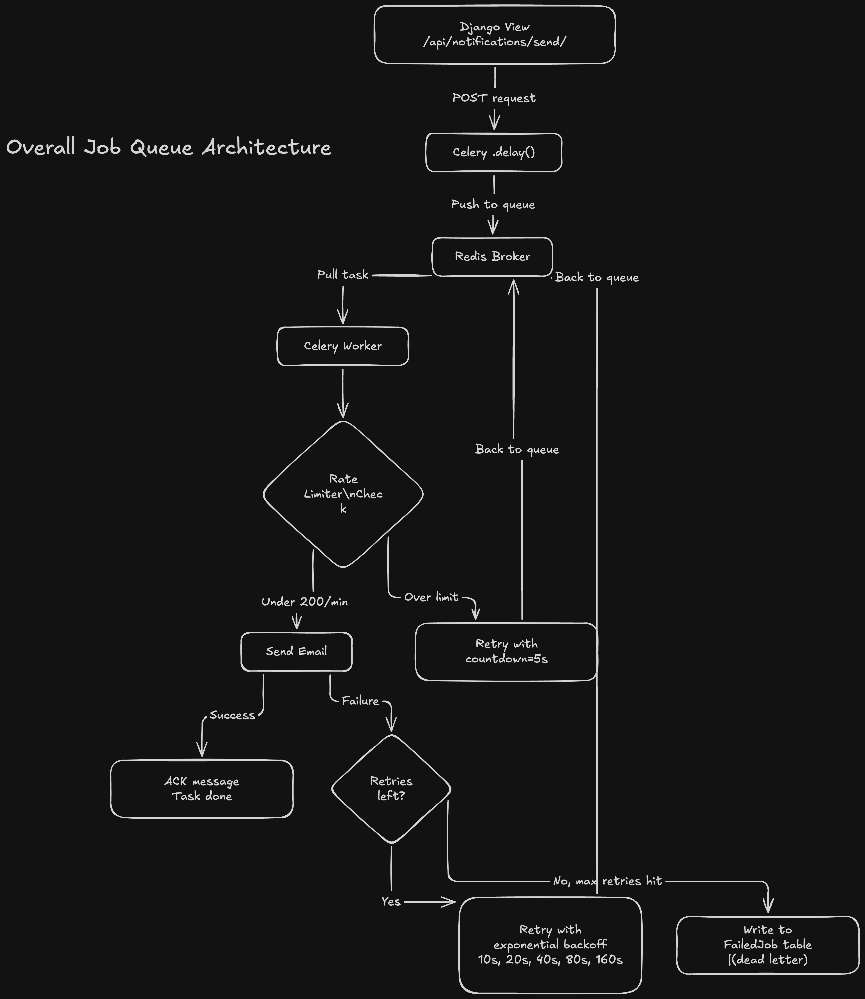
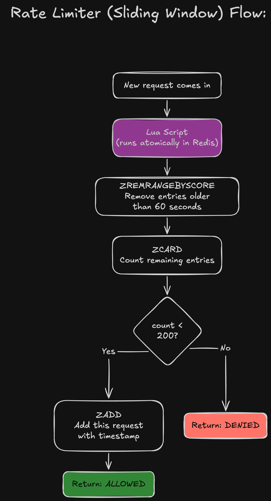
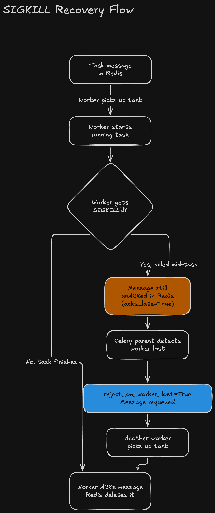

# DESIGN.md — Section 2: Architecture Decisions

## Job Queue Selection

### Options I Looked At

| Criteria | Celery + Redis | Django-Q | Custom Queue |
|---|---|---|---|
| **How proven is it** | Been around 10+ years, huge community, used everywhere | Smaller community, fewer people maintaining it | No community at all — it's just our code |
| **What brokers it supports** | Redis, RabbitMQ, SQS, and more | Redis or Django ORM | We'd have to build on top of Redis ourselves |
| **Retry and backoff** | Built-in — `autoretry_for`, `retry_backoff`, `max_retries` | Has basic retry but not as flexible | We'd have to write all of this from scratch |
| **Monitoring** | Flower, django-celery-results, good logging | Django admin integration | Nothing — we'd have to build that too |
| **How hard to learn** | Medium — lots of docs but also lots of config options | Easy — simpler API | Hardest — debugging our own queue code |
| **Risk in production** | Low — battle-tested | Medium — not as proven under heavy load | High — completely untested |
| **Setup work** | Needs Redis + a separate worker process | Easier — can even use the Django ORM as broker | Just Redis, but way more custom code |

### Decision: Celery + Redis

**Why:** The assignment asks for exponential backoff, dead-letter handling, and rate limiting. Celery already has `max_retries`, `countdown`, and `bind=True` built in. Django-Q could technically work, but its retry support isn't as strong. Building a custom queue from scratch would mean re-building stuff that Celery already does — and the assignment brief says not to over-engineer.

I'm using Redis as the broker because we already need Redis for the rate limiter. No point adding a second piece of infrastructure like RabbitMQ. RabbitMQ is better for guaranteed delivery, but Redis with `acks_late=True` is good enough here.



---

## Rate Limiter Design

### Algorithm: Sliding Window Log (Redis Sorted Set)

I looked at three common rate limiting approaches:

| Algorithm | Accuracy | Memory Use | Atomicity | Complexity |
|---|---|---|---|---|
| **Fixed Window Counter** | Not great — can allow 2x the limit at window edges | Very low (just one counter) | Easy (`INCR` + `EXPIRE`) | Simplest |
| **Sliding Window Log** | Exact — tracks every single request | Higher (one entry per request) | Atomic with a Lua script | Medium |
| **Token Bucket** | Good — smooths out traffic, allows small bursts | Low (a counter + timestamp) | Needs Lua for refill + consume | Medium |

### Why I Picked Sliding Window Log

1. **It's exact.** The test says "rate limit is never exceeded" — so I need something precise. Fixed window has a well-known edge case: if 200 requests come at the end of one window and 200 more at the start of the next, that's 400 requests within 60 seconds even though the limit is 200. Sliding window doesn't have this problem because it always looks at the last 60 seconds from right now.

2. **It's easy to understand.** One Redis sorted set. Timestamps as scores. `ZREMRANGEBYSCORE` to remove old entries, `ZCARD` to count what's left, `ZADD` to add a new one. Three commands, straightforward logic.

3. **Memory isn't an issue.** With a 200/min limit, the sorted set has at most 200 entries. Each entry is about 50 bytes. That's roughly 10KB — Redis won't even notice.



### How Atomicity Is Guaranteed

The whole "check if we're under the limit, and if so add the request" logic is wrapped in a **Lua script**:

```lua
-- This runs as one atomic operation — nothing else can interrupt it
local window_start = now - window_ms
redis.call('ZREMRANGEBYSCORE', key, '-inf', window_start)  -- clean out old entries
local current_count = redis.call('ZCARD', key)              -- count what's left
if current_count < limit then
    redis.call('ZADD', key, now, request_id)                -- add new entry
    return 1  -- allowed
end
return 0  -- denied
```

**Why this works:** Redis runs Lua scripts on its single thread. Nothing else can run between the `ZCARD` (the count check) and the `ZADD` (adding the new entry). Without this, you could get a race condition: two workers both see count=199, both think they're under the limit, and both add a request — ending up at 201, which breaks the 200 limit.

I could have used `MULTI`/`EXEC` (Redis transactions), but those don't support if/else logic — I can't say "check the count, then decide whether to add." `WATCH`/`MULTI`/`EXEC` does support that, but it needs retry loops for conflicts. Lua is simpler and just works.

### What Happens If Redis Goes Down

**Decision: Fail-open (let requests through).**

If Redis is unreachable, the rate limiter catches the connection error and returns `True` (allowed).

**Why:**
- The main job here is sending emails. If Redis is briefly down, I'd rather send the emails (maybe a bit faster than 200/min) than stop sending them completely.
- The email provider (SendGrid, SES, whatever) has its own rate limits on their end — so there's a safety net even if ours goes down.
- If I went fail-closed instead, a quick Redis blip would block all email sending. That's worse than a temporary burst.

**The trade-off:** If Redis stays down for a long time, we have no rate limiting at all. In production you'd want an alert on Redis health and maybe a circuit breaker. But for this assessment, fail-open is the right call.

---

## Celery Worker Configuration

The key settings that make things reliable:

| Setting | Value | What it does |
|---|---|---|
| `acks_late` | `True` | The worker only tells Redis "I'm done" after the task finishes. If the worker dies mid-task, Redis still has the message and will give it to another worker. |
| `reject_on_worker_lost` | `True` | If a worker process gets killed (like `kill -9`), the message gets put back in the queue instead of being lost. |
| `max_retries` | `5` | Retries with exponential backoff: 10s → 20s → 40s → 80s → 160s (about 5 minutes of total retry time). |



See `ANSWERS.md` (Section 2) for a more detailed writeup on what happens when a worker gets SIGKILL'd.
